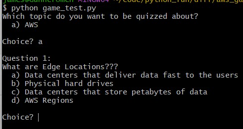

## AWS :cloud: PRACTITIONER I QUIZ

### An Interactive quiz w/ our friend python :snake:

```py
Thanks for visiting our repo. 
If you stumbled upon this readme, 
we assume you're interested in learning more about AWS. 
Look No further. 
This quiz is for newbies looking to step into a new realm
as well as more experienced devs looking to learn the cloud.
really, this quiz is for everyone
We just want you to have fun while you learn.
We will try to lay out the next steps in the best way possible. 
Best of luck with your studies!!!!!
```

### 1. Open the quiz :book:

```sh
mkdir aws
cd aws
git clone https://github.com/jmsgnnr/aws_game.git
cd aws_game
code .
```

### 2.  Run the files :runner:

```sh
python game_test.py
```



*editor note: your terminal **SHOULD** look something like this ^*

#### :bulb:Confused? Check out the docs:bulb:

- python :snake:
  - [Download](https://www.python.org/downloads/)
  - [Tutorial](https://docs.python.org/3/tutorial/)
- command line basics :computer:
  - [terminal-commands](https://realpython.com/terminal-commands/)
  - [basic-git-commands](https://confluence.atlassian.com/bitbucketserver/basic-git-commands-776639767.html)
  - [linux-for-beginners](https://maker.pro/linux/tutorial/basic-linux-commands-for-beginners)
- code editor (We recommend visual studio code) :pager:
  - [Visual Studio Code](https://code.visualstudio.com/download)
  - [vsc-python-tutorial](https://code.visualstudio.com/docs/python/python-tutorial)
- source code :information_source:
  - [learn-how-this-repo-was-built](https://realpython.com/python-quiz-application/)
  - [w3-schools-cloud-essentials](https://www.w3schools.com/quiztest/quiztest.php?qtest=AWSCE)
